<div align="center">
  
</div>

<div align="center">

[](https://git.io/typing-svg)

<br/><br/>


&nbsp;

&nbsp;

&nbsp;


</div>

<br/>

<br/>


---


## `> whoami`

```typescript
const sunny = {
  role: "Aspiring Software Engineer",
  education: "Bachelor of Computer Applications • Manipal University Jaipur",

  focus: [
    "Full-Stack Development",
    "Java & DSA",
    "System Design"
  ],

  stack: [
    "Java",
    "JavaScript",
    "React",
    "Node.js",
    "Next.js"
  ],

};
```


---


## `> tech-stack`

<p>


</p>


---


## `> github-stats`

<p align="center">
  

  
</p>

<br clear="both"/>

<p align="left">
  
</p>


---


## `> contribution-activity`

<div align="center">

[](https://github.com/ashutosh00710/github-readme-activity-graph)

</div>


---

<!--
## 🐍 Contribution Snake

<div align="center">


</div>


---
-->


## `> connect --with-me`

<div align="center">

<a href="mailto:sunnysinghcodex@gmail.com">
  
</a>
&nbsp;

<a href="https://www.linkedin.com/in/sunnycodes-tech/" target="_blank">
  
</a>
&nbsp;

<a href="https://github.com/Sunnycodes-tech" target="_blank">
  
</a>
&nbsp;

<a href="https://x.com/sunnycode_x" target="_blank">
  
</a>
&nbsp;

<a href="https://www.threads.com/@sunnycode_x" target="_blank">
  
</a>
&nbsp;

<a href="https://www.instagram.com/_sunnyy_singh/" target="_blank">
  
</a>
&nbsp;

<a href="https://www.reddit.com/user/sunny_codex/" target="_blank">
  
</a>
&nbsp;

<a href="https://www.quora.com/profile/Sunny-Codex" target="_blank">
  
</a>


</div>


---


## `> contact --me`

**Always open to meaningful collaborations, great projects, and open-source opportunities.**

<p align="center">
  <a href="https://www.linkedin.com/in/sunnycodes-tech/">
    
  </a>
    &nbsp;&nbsp;&nbsp;
  <a href="mailto:sunnysinghcodex@gmail.com">
    
  </a>
</p>

**Built with intent. Shipped with purpose.**<br>
